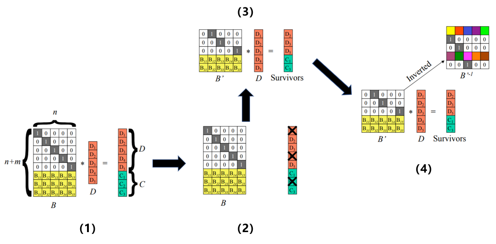
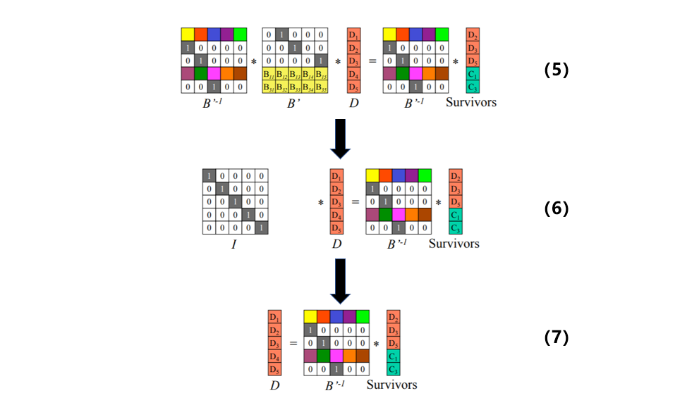

# Erasure Code
This is a simple HelloWorld of EC.

### 1.Comparison of the EC and traditional method

| Erasure Coding                      | Replication                    |
| ----------------------------------- | ------------------------------ |
| "cold" data/unlikely to be accessed | hot data                       |
| complex system/challenging          | simple/direct                  |
| better on storage efficiency        | consume more data storage      |
| low read performance                | write slow(heavy network load) |
| high CPU consumption                | almost zero CPU                |
|                                     |                                |

### 2.Reed-Solomon Codes 

    

    

